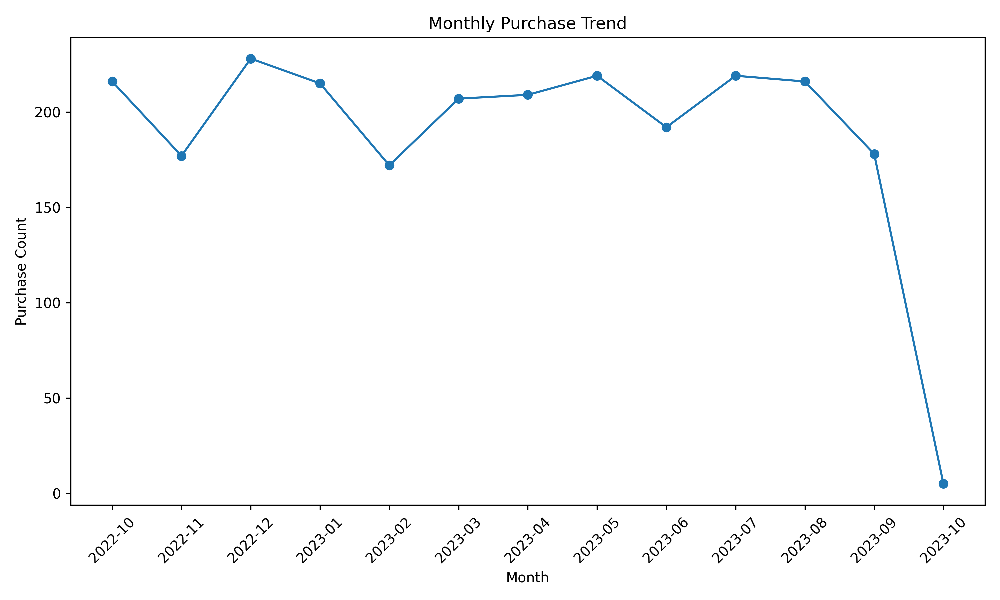
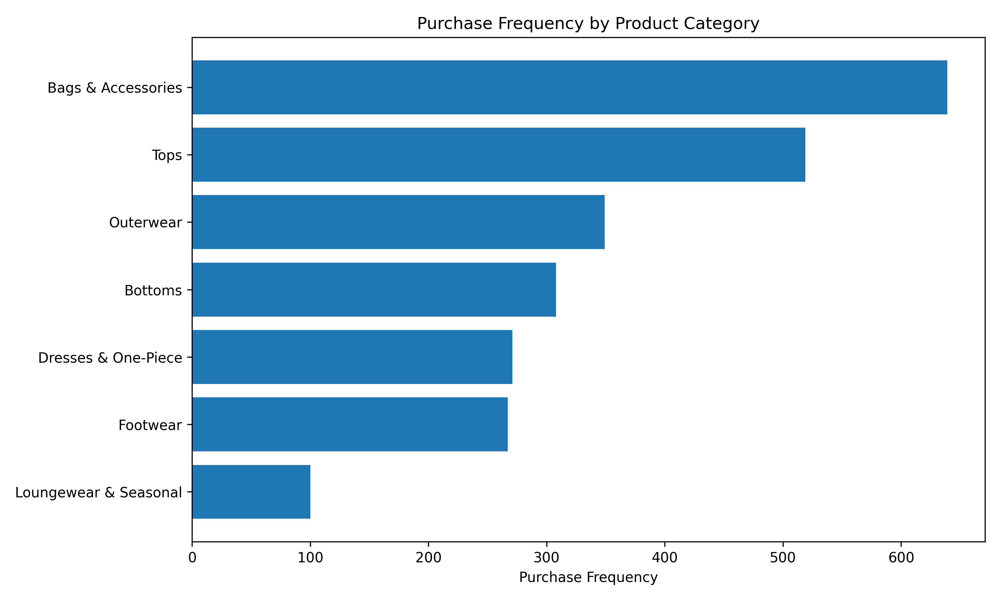
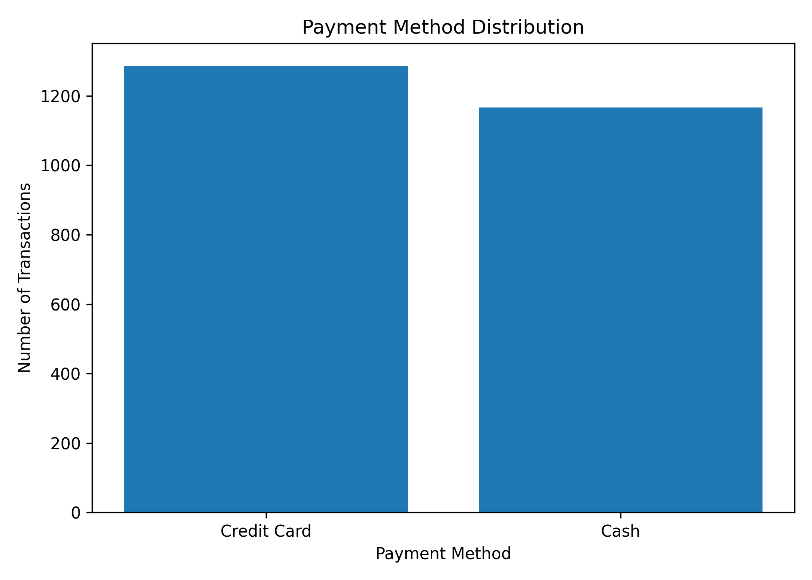
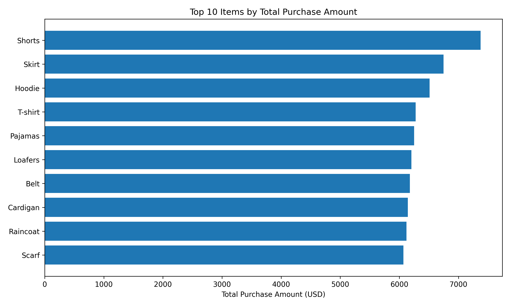
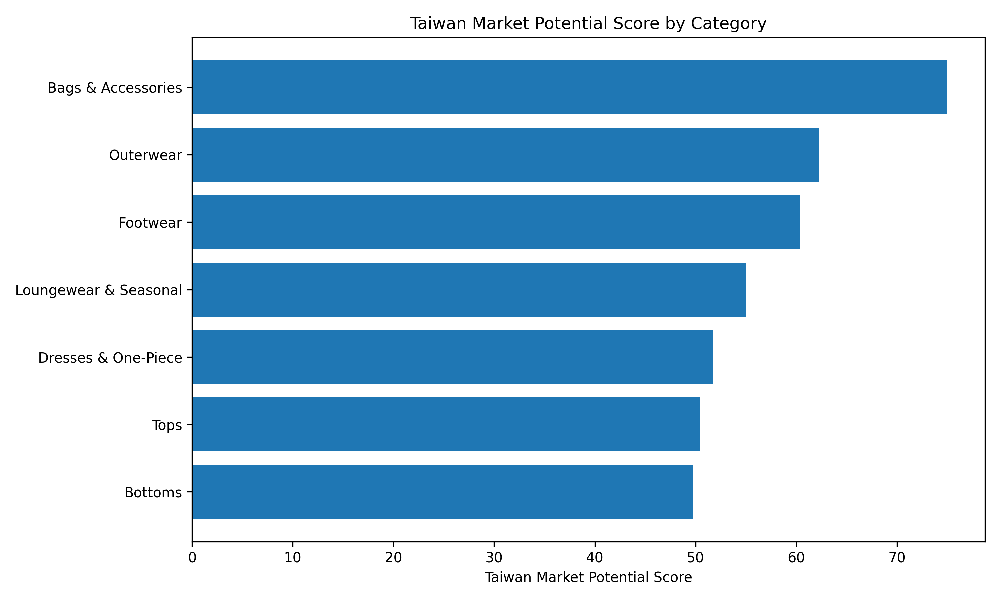

# Fashion Retail Taiwan Market Analysis

## Overview

This Business Analytics portfolio project analyzes a global fashion retail dataset to identify product categories with strong potential in the Taiwan market. The project demonstrates the complete data analytics workflow, including data cleaning, exploratory data analysis (EDA), visualization, and business recommendations using Python.

---

## Project Objectives

- Clean and preprocess retail transaction data
- Analyze purchasing behavior across product categories
- Identify high-performing fashion products
- Develop a Taiwan Market Potential Score
- Create business insights through data visualization

---

## Tools & Technologies

- Python
- Pandas
- NumPy
- Matplotlib
- GitHub

---

## Project Structure

```text
fashion-retail-taiwan-market-analysis
│
├── data
│   ├── raw
│   └── cleaned
├── images
├── scripts
├── LICENSE
└── README.md
```

---

## Key Visualizations

### Figure 1. Monthly Purchase Trend



---

### Figure 2. Purchase Frequency by Product Category



---

### Figure 3. Payment Method Distribution



---

### Figure 4. Top 10 Items by Total Purchase Amount



---

### Figure 5. Taiwan Market Potential Score



---

## Business Insights

- Bags & Accessories achieved the highest Taiwan Market Potential Score.
- Credit card transactions were slightly more common than cash payments.
- Purchasing activity remained relatively stable throughout most months.
- Several fashion categories showed strong opportunities for Taiwan's retail market.

---

## Author

**Fu-Min Yang**  
Business Analytics Student  
San Jose State University
